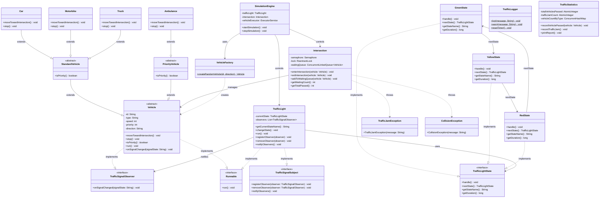

# Class Diagram - Smart Traffic Simulator

Dán đoạn Mermaid bên dưới vào trang https://mermaid.live để xem hình ảnh.

```mermaid
classDiagram
    direction TB

    %% ========== INTERFACES ==========
    class Runnable {
        <<interface>>
        +run() void
    }

    class TrafficSignalObserver {
        <<interface>>
        +onSignalChanged(signalState: String) void
    }

    class TrafficSignalSubject {
        <<interface>>
        +registerObserver(observer: TrafficSignalObserver) void
        +removeObserver(observer: TrafficSignalObserver) void
        +notifyObservers() void
    }

    class TrafficLightState {
        <<interface>>
        +handle() void
        +nextState() TrafficLightState
        +getStateName() String
        +getDuration() long
    }

    %% ========== ENTITY - Vehicle Hierarchy ==========
    class Vehicle {
        <<abstract>>
        -id: String
        -type: String
        -speed: int
        -priority: int
        -direction: String
        +moveTowardIntersection() void*
        +stop() void*
        +isPriority() boolean*
        +run() void
        +onSignalChanged(signalState: String) void
    }

    class StandardVehicle {
        <<abstract>>
        +isPriority() boolean
    }

    class PriorityVehicle {
        <<abstract>>
        +isPriority() boolean
    }

    class Car {
        +moveTowardIntersection() void
        +stop() void
    }

    class Motorbike {
        +moveTowardIntersection() void
        +stop() void
    }

    class Truck {
        +moveTowardIntersection() void
        +stop() void
    }

    class Ambulance {
        +moveTowardIntersection() void
        +stop() void
    }

    %% ========== STATE PATTERN ==========
    class GreenState {
        +handle() void
        +nextState() TrafficLightState
        +getStateName() String
        +getDuration() long
    }

    class YellowState {
        +handle() void
        +nextState() TrafficLightState
        +getStateName() String
        +getDuration() long
    }

    class RedState {
        +handle() void
        +nextState() TrafficLightState
        +getStateName() String
        +getDuration() long
    }

    %% ========== ENGINE ==========
    class TrafficLight {
        -currentState: TrafficLightState
        -observers: List~TrafficSignalObserver~
        +getCurrentStateName() String
        +changeState() void
        +run() void
        +registerObserver(observer) void
        +removeObserver(observer) void
        +notifyObservers() void
    }

    class Intersection {
        -semaphore: Semaphore
        -lock: ReentrantLock
        -waitingQueue: ConcurrentLinkedQueue~Vehicle~
        +enterIntersection(vehicle: Vehicle) void
        +exitIntersection(vehicle: Vehicle) void
        +addToWaitingQueue(vehicle: Vehicle) void
        +getWaitingCount() int
        +getTotalPassed() int
    }

    class SimulationEngine {
        -trafficLight: TrafficLight
        -intersection: Intersection
        -vehicleExecutor: ExecutorService
        +startSimulation() void
        +stopSimulation() void
    }

    %% ========== FACTORY ==========
    class VehicleFactory {
        +createRandomVehicle(id, direction)$ Vehicle
    }

    %% ========== EXCEPTION ==========
    class TrafficJamException {
        +TrafficJamException(message: String)
    }

    class CollisionException {
        +CollisionException(message: String)
    }

    %% ========== UTIL ==========
    class TrafficLogger {
        +log(message: String)$ void
        +warn(message: String)$ void
        +resetTimer()$ void
    }

    class TrafficStatistics {
        -totalVehiclesPassed: AtomicInteger
        -trafficJamCount: AtomicInteger
        -vehicleCountByType: ConcurrentHashMap
        +recordVehiclePassed(vehicle: Vehicle) void
        +recordTrafficJam() void
        +printReport() void
    }

    %% ========== RELATIONSHIPS ==========
    Vehicle ..|> Runnable : implements
    Vehicle ..|> TrafficSignalObserver : implements
    StandardVehicle --|> Vehicle : extends
    PriorityVehicle --|> Vehicle : extends
    Car --|> StandardVehicle : extends
    Motorbike --|> StandardVehicle : extends
    Truck --|> StandardVehicle : extends
    Ambulance --|> PriorityVehicle : extends

    GreenState ..|> TrafficLightState : implements
    YellowState ..|> TrafficLightState : implements
    RedState ..|> TrafficLightState : implements
    GreenState --> YellowState : nextState
    YellowState --> RedState : nextState
    RedState --> GreenState : nextState

    TrafficLight ..|> Runnable : implements
    TrafficLight ..|> TrafficSignalSubject : implements
    TrafficLight --> TrafficLightState : uses
    TrafficLight --> TrafficSignalObserver : notifies

    Intersection --> Vehicle : manages
    Intersection ..> TrafficJamException : throws
    Intersection ..> CollisionException : throws

    SimulationEngine --> TrafficLight : controls
    SimulationEngine --> Intersection : controls
    SimulationEngine --> VehicleFactory : uses

    VehicleFactory ..> Vehicle : creates
```
