# 📊 PHÂN TÍCH ĐỀ TÀI: HỆ THỐNG MÔ PHỎNG GIAO THÔNG THÔNG MINH

## I. Tổng quan - Hệ thống này làm gì?

Hãy tưởng tượng bạn đứng trên tầng cao nhìn xuống **một ngã tư đường phố**. Bạn thấy:
- 🚗 Xe cộ từ 4 hướng liên tục chạy đến
- 🚦 Đèn giao thông tự động chuyển Xanh → Vàng → Đỏ
- 🚑 Thỉnh thoảng xe cứu thương xuất hiện, các xe khác phải nhường đường
- 📊 Có một bảng thống kê: bao nhiêu xe đã qua, có kẹt xe không?

**Đề tài yêu cầu bạn mô phỏng toàn bộ cảnh tượng đó bằng code Java**, in kết quả ra Console.

---

## II. Tại sao đề tài này khó?

Đề tài **KHÔNG** đơn giản là "tạo class xe, class đèn, chạy vòng lặp". Nó khó vì nó yêu cầu **đa luồng (multithreading)** - tức là nhiều thứ chạy **đồng thời cùng lúc**:

| Thứ chạy đồng thời | Giải thích |
|---|---|
| Mỗi xe là 1 luồng (thread) | Xe A đang chạy, xe B cũng đang chạy, xe C cũng đang chạy... tất cả cùng lúc |
| Đèn giao thông là 1 luồng riêng | Đèn tự động đếm thời gian và chuyển trạng thái, không phụ thuộc vào xe |
| Hệ thống sinh xe là 1 luồng | Cứ mỗi vài giây lại "đẻ" ra xe mới |

**Vấn đề cốt lõi**: Khi nhiều xe cùng muốn đi qua ngã tư → phải có cơ chế "xếp hàng" và "khóa" để không xảy ra va chạm (race condition).

---

## III. Các thành phần chính - Giải thích từng phần

### 1. 🚗 Vehicle (Phương tiện) - "Ai tham gia giao thông?"

```
Vehicle (Lớp cha - abstract)
├── StandardVehicle (Xe thường)
│   ├── Motorbike (Xe máy) - tốc độ nhanh, kích thước nhỏ
│   ├── Car (Ô tô) - tốc độ trung bình
│   └── Truck (Xe tải) - tốc độ chậm, kích thước lớn
└── PriorityVehicle (Xe ưu tiên)
    ├── Ambulance (Xe cứu thương) - được vượt đèn đỏ
    └── (Tương lai: FireTruck - Xe cứu hỏa)
```

**Tại sao thiết kế thế này?**
- **OCP (Open/Closed Principle)**: Muốn thêm xe cứu hỏa? Chỉ cần tạo class `FireTruck extends PriorityVehicle`. Không cần sửa bất kỳ code cũ nào.
- **LSP (Liskov Substitution)**: Ở bất kỳ đâu dùng [Vehicle](file:///d:/Java%20Andvanced/ThucHanhSession09/src/entity/Vehicle.java#11-62), bạn có thể thay bằng [Car](file:///d:/Java%20Andvanced/ThucHanhSession09/src/entity/Car.java#8-22), [Ambulance](file:///d:/Java%20Andvanced/ThucHanhSession09/src/entity/Ambulance.java#8-22)... mà code vẫn chạy đúng.

### 2. 🚦 TrafficLight (Đèn giao thông) - "Ai điều khiển?"

Đèn giao thông có 3 trạng thái: **GREEN → YELLOW → RED → GREEN → ...**

Đề tài yêu cầu dùng **State Pattern** để quản lý. Nghĩa là:

```
Thay vì viết:
    if (state == "GREEN") { ... }
    else if (state == "YELLOW") { ... }
    else if (state == "RED") { ... }

Thì tạo 3 class riêng:
    GreenState  → biết cách chuyển sang YellowState
    YellowState → biết cách chuyển sang RedState
    RedState    → biết cách chuyển sang GreenState
```

**Lợi ích**: Mỗi class chỉ lo 1 trạng thái. Muốn thêm trạng thái mới (ví dụ: đèn nhấp nháy) → tạo class mới, không sửa code cũ.

### 3. 🔀 Intersection (Ngã tư) - "Vùng nguy hiểm"

Ngã tư là **tài nguyên chung** (shared resource). Chỉ có **N xe** được phép đi qua cùng lúc.

**Ví dụ thực tế**: Ngã tư có 2 làn → tối đa 2 xe đi qua cùng lúc. Xe thứ 3 phải **ĐỢI**.

Đây là nơi cần dùng **Synchronization**:

```
Semaphore semaphore = new Semaphore(2); // Cho phép tối đa 2 xe qua cùng lúc

// Mỗi xe khi muốn qua ngã tư:
semaphore.acquire();   // Xin phép vào (nếu đầy → chờ)
// ... xe đi qua ngã tư ...
semaphore.release();   // Ra khỏi ngã tư, nhường chỗ
```

### 4. 👀 Observer Pattern - "Đèn thay đổi → Xe phản ứng"

```
TrafficLight (Subject - Người phát tín hiệu)
    │
    ├── notifyAll("GREEN") ──→ Xe A: "OK, tôi đi!"
    ├── notifyAll("GREEN") ──→ Xe B: "OK, tôi cũng đi!"
    └── notifyAll("RED")   ──→ Xe C: "Dừng lại!"
```

**Cách hoạt động**:
1. Các xe "đăng ký" theo dõi đèn giao thông
2. Khi đèn chuyển trạng thái → tự động thông báo cho TẤT CẢ xe đang chờ
3. Xe nhận tín hiệu → quyết định đi tiếp hay dừng

### 5. 🏭 Factory Method - "Máy sản xuất xe"

```java
VehicleFactory.createRandomVehicle()
// Có thể trả về: Car, Motorbike, Truck, hoặc Ambulance
// Xác suất: 40% xe máy, 30% ô tô, 20% xe tải, 10% xe cứu thương
```

Thay vì viết `new Car()`, `new Truck()` rải rác khắp nơi, ta gom vào 1 chỗ duy nhất (Factory). Khi thêm loại xe mới → chỉ sửa Factory.

---

## IV. Luồng hoạt động chính (Kịch bản mô phỏng)

```
┌─────────────────────────────────────────────────────────┐
│                    KỊCH BẢN MÔ PHỎNG                    │
├─────────────────────────────────────────────────────────┤
│                                                         │
│  1. Khởi động hệ thống                                 │
│     ├─ Tạo Intersection (ngã tư)                        │
│     ├─ Tạo TrafficLight (bắt đầu trạng thái GREEN)     │
│     └─ Khởi chạy thread đèn giao thông (Daemon Thread) │
│                                                         │
│  2. Vòng lặp chính (chạy N giây)                       │
│     ├─ Mỗi 2-3 giây: VehicleFactory sinh xe mới        │
│     ├─ Xe mới → chạy trên thread riêng                 │
│     └─ Xe tiến về ngã tư                                │
│                                                         │
│  3. Xe đến ngã tư                                       │
│     ├─ Kiểm tra đèn:                                   │
│     │   ├─ GREEN → xin phép vào ngã tư (acquire lock)  │
│     │   ├─ RED → vào hàng đợi, chờ đèn xanh            │
│     │   └─ Xe cứu thương → LUÔN được vào (ưu tiên)     │
│     ├─ Đi qua ngã tư (mất vài giây tùy loại xe)       │
│     └─ Ra khỏi ngã tư (release lock)                   │
│                                                         │
│  4. Kết thúc                                            │
│     ├─ In thống kê: tổng xe qua, xe theo loại          │
│     ├─ Số lần kẹt xe (hàng đợi > ngưỡng)              │
│     └─ Shutdown tất cả thread                           │
│                                                         │
└─────────────────────────────────────────────────────────┘
```

---

## V. Các Design Patterns được sử dụng - Tóm tắt

| Pattern | Dùng ở đâu | Giải quyết vấn đề gì |
|---|---|---|
| **State** | [TrafficLight](file:///d:/Java%20Andvanced/ThucHanhSession09/src/engine/TrafficLight.java#18-73) + các State class | Quản lý chuyển trạng thái đèn mà không dùng if-else dài |
| **Observer** | [TrafficLight](file:///d:/Java%20Andvanced/ThucHanhSession09/src/engine/TrafficLight.java#18-73) → [Vehicle](file:///d:/Java%20Andvanced/ThucHanhSession09/src/entity/Vehicle.java#11-62) | Đèn thay đổi → tự động thông báo cho xe, không cần xe liên tục hỏi "đèn gì rồi?" |
| **Factory Method** | [VehicleFactory](file:///d:/Java%20Andvanced/ThucHanhSession09/src/pattern/factory/VehicleFactory.java#10-34) | Tạo xe ngẫu nhiên tại 1 nơi duy nhất, dễ mở rộng |

---

## VI. Class Diagram

```mermaid
classDiagram
    direction TB

    %% ========== INTERFACES ==========
    class Runnable {
        <<interface>>
        +run() void
    }

    class TrafficSignalObserver {
        <<interface>>
        +onSignalChanged(signalState: String) void
    }

    class TrafficSignalSubject {
        <<interface>>
        +registerObserver(observer: TrafficSignalObserver) void
        +removeObserver(observer: TrafficSignalObserver) void
        +notifyObservers() void
    }

    class TrafficLightState {
        <<interface>>
        +handle() void
        +nextState() TrafficLightState
        +getStateName() String
        +getDuration() long
    }

    %% ========== ENTITY - Vehicle Hierarchy ==========
    class Vehicle {
        <<abstract>>
        -id: String
        -type: String
        -speed: int
        -priority: int
        -direction: String
        +moveTowardIntersection() void*
        +stop() void*
        +isPriority() boolean*
        +run() void
        +onSignalChanged(signalState: String) void
    }

    class StandardVehicle {
        <<abstract>>
        +isPriority() boolean
    }

    class PriorityVehicle {
        <<abstract>>
        +isPriority() boolean
    }

    class Car {
        +moveTowardIntersection() void
        +stop() void
    }

    class Motorbike {
        +moveTowardIntersection() void
        +stop() void
    }

    class Truck {
        +moveTowardIntersection() void
        +stop() void
    }

    class Ambulance {
        +moveTowardIntersection() void
        +stop() void
    }

    %% ========== STATE PATTERN ==========
    class GreenState {
        +handle() void
        +nextState() TrafficLightState
        +getStateName() String
        +getDuration() long
    }

    class YellowState {
        +handle() void
        +nextState() TrafficLightState
        +getStateName() String
        +getDuration() long
    }

    class RedState {
        +handle() void
        +nextState() TrafficLightState
        +getStateName() String
        +getDuration() long
    }

    %% ========== ENGINE ==========
    class TrafficLight {
        -currentState: TrafficLightState
        -observers: List~TrafficSignalObserver~
        +getCurrentStateName() String
        +changeState() void
        +run() void
        +registerObserver(observer) void
        +removeObserver(observer) void
        +notifyObservers() void
    }

    class Intersection {
        -semaphore: Semaphore
        -lock: ReentrantLock
        -waitingQueue: ConcurrentLinkedQueue~Vehicle~
        +enterIntersection(vehicle: Vehicle) void
        +exitIntersection(vehicle: Vehicle) void
        +addToWaitingQueue(vehicle: Vehicle) void
        +getWaitingCount() int
        +getTotalPassed() int
    }

    class SimulationEngine {
        -trafficLight: TrafficLight
        -intersection: Intersection
        -vehicleExecutor: ExecutorService
        +startSimulation() void
        +stopSimulation() void
    }

    %% ========== FACTORY ==========
    class VehicleFactory {
        +createRandomVehicle(id, direction)$ Vehicle
    }

    %% ========== EXCEPTION ==========
    class TrafficJamException {
        +TrafficJamException(message: String)
    }

    class CollisionException {
        +CollisionException(message: String)
    }

    %% ========== UTIL ==========
    class TrafficLogger {
        +log(message: String)$ void
        +warn(message: String)$ void
        +resetTimer()$ void
    }

    class TrafficStatistics {
        -totalVehiclesPassed: AtomicInteger
        -trafficJamCount: AtomicInteger
        -vehicleCountByType: ConcurrentHashMap
        +recordVehiclePassed(vehicle: Vehicle) void
        +recordTrafficJam() void
        +printReport() void
    }

    %% ========== RELATIONSHIPS ==========
    Vehicle ..|> Runnable : implements
    Vehicle ..|> TrafficSignalObserver : implements
    StandardVehicle --|> Vehicle : extends
    PriorityVehicle --|> Vehicle : extends
    Car --|> StandardVehicle : extends
    Motorbike --|> StandardVehicle : extends
    Truck --|> StandardVehicle : extends
    Ambulance --|> PriorityVehicle : extends

    GreenState ..|> TrafficLightState : implements
    YellowState ..|> TrafficLightState : implements
    RedState ..|> TrafficLightState : implements
    GreenState --> YellowState : nextState
    YellowState --> RedState : nextState
    RedState --> GreenState : nextState

    TrafficLight ..|> Runnable : implements
    TrafficLight ..|> TrafficSignalSubject : implements
    TrafficLight --> TrafficLightState : uses
    TrafficLight --> TrafficSignalObserver : notifies

    Intersection --> Vehicle : manages
    Intersection ..> TrafficJamException : throws
    Intersection ..> CollisionException : throws

    SimulationEngine --> TrafficLight : controls
    SimulationEngine --> Intersection : controls
    SimulationEngine --> VehicleFactory : uses

    VehicleFactory ..> Vehicle : creates
```



---

## VII. Cấu trúc thư mục (26 file)

```
src/
├── Main.java                              ★ Người 3
│
├── entity/                                ★ Người 1 (7 file)
│   ├── Vehicle.java                       (abstract - lớp cha)
│   ├── StandardVehicle.java               (abstract - xe thường)
│   ├── PriorityVehicle.java               (abstract - xe ưu tiên)
│   ├── Car.java
│   ├── Motorbike.java
│   ├── Truck.java
│   └── Ambulance.java
│
├── pattern/                               ★ Người 2 (7 file)
│   ├── state/
│   │   ├── TrafficLightState.java         (Interface)
│   │   ├── GreenState.java
│   │   ├── YellowState.java
│   │   └── RedState.java
│   ├── observer/
│   │   ├── TrafficSignalSubject.java      (Interface)
│   │   └── TrafficSignalObserver.java     (Interface)
│   └── factory/
│       └── VehicleFactory.java            ★ Người 1
│
├── engine/                                ★ Người 3 (3 file)
│   ├── TrafficLight.java                  ★ Người 2 (Đèn giao thông - Subject)
│   ├── Intersection.java                  (Ngã tư - Critical Section)
│   └── SimulationEngine.java              (Điều phối toàn bộ)
│
├── exception/                             ★ Người 4 (2 file)
│   ├── TrafficJamException.java
│   └── CollisionException.java
│
├── util/                                  ★ Người 4 (2 file)
│   ├── TrafficLogger.java                 (Ghi log ra console)
│   └── TrafficStatistics.java             (Thống kê)
│
└── test/                                  ★ Người 4 (4 file - JUnit 5)
    ├── TrafficLightStateTest.java         (Test State Pattern)
    ├── IntersectionStressTest.java        (Stress test 100 xe đa luồng)
    ├── VehicleFactoryTest.java            (Test Factory Method)
    └── TrafficStatisticsTest.java         (Test thống kê thread-safe)
```

---

## VIII. Giải thích các khái niệm khó

### 🔒 Critical Section là gì?
Là đoạn code mà **chỉ 1 thread (hoặc N thread giới hạn) được chạy tại 1 thời điểm**. Ở đây, ngã tư là critical section - không thể cho 100 xe cùng đi qua 1 lúc.

### 🧵 Daemon Thread là gì?
Là thread chạy nền, **tự động dừng khi chương trình chính kết thúc**. Đèn giao thông chạy trên daemon thread → khi mô phỏng kết thúc, đèn tự tắt.

### 🔄 Race Condition là gì?
Khi 2 thread cùng truy cập 1 tài nguyên → kết quả không đoán trước được. Ví dụ: 2 xe cùng lao vào ngã tư khi chỉ còn 1 chỗ trống → **va chạm**!

### 📦 ConcurrentLinkedQueue là gì?
Là hàng đợi (Queue) **an toàn khi nhiều thread truy cập cùng lúc**. Thay vì dùng `ArrayList` (không thread-safe), dùng `ConcurrentLinkedQueue` để xếp hàng xe chờ đèn đỏ.

---

## IX. Sequence Diagram - Kịch bản xe cứu thương

```
Thời gian ──────────────────────────────────────────→

Car (Ô tô)          TrafficLight         Intersection         Ambulance (Cứu thương)
    │                     │                    │                      │
    │──── tiến đến ──────→│                    │                      │
    │                     │── đèn RED ────────→│                      │
    │←── DỪNG LẠI ────── │                    │                      │
    │  (vào hàng đợi)     │                    │                      │
    │                     │                    │                      │
    │                     │                    │←──── tiến đến ───────│
    │                     │                    │                      │
    │                     │                    │── Kiểm tra: là xe    │
    │                     │                    │   ưu tiên? → CÓ     │
    │                     │                    │                      │
    │←── nhường đường ────│────────────────────│── CHO PHÉP ĐI QUA ──│
    │  (xe ô tô đợi thêm)│                    │   (bỏ qua đèn đỏ)   │
    │                     │                    │                      │
    │                     │                    │←── xe cứu thương ────│
    │                     │                    │    đi qua xong       │
    │                     │                    │                      │
    │                     │── đèn GREEN ──────→│                      │
    │←── TÍN HIỆU ĐI ── │                    │                      │
    │                     │                    │                      │
    │──── xin vào ───────→│───────────────────→│                      │
    │                     │                    │── acquire lock       │
    │←── ĐI QUA ──────── │                    │                      │
    │                     │                    │── release lock       │
```

---

## X. Tóm tắt - Bạn cần làm gì?

| Giai đoạn | Việc cần làm | Mức độ khó |
|---|---|---|
| **1. Thiết kế** | Vẽ Class Diagram, Sequence Diagram | ⭐⭐ |
| **2. Entities** | Tạo các class Vehicle, Car, Ambulance... | ⭐⭐ |
| **3. Patterns** | Implement State, Observer, Factory | ⭐⭐⭐ |
| **4. Engine** | TrafficLight thread, Intersection lock, SimulationEngine | ⭐⭐⭐⭐⭐ |
| **5. Exception** | TrafficJamException, CollisionException | ⭐⭐ |
| **6. Testing** | Unit test + Stress test đa luồng | ⭐⭐⭐⭐ |
| **7. Tối ưu** | ReadWriteLock, README.md | ⭐⭐⭐ |

> [!TIP]
> Phần **khó nhất** là bước 4 - Engine. Đây là nơi bạn phải kết hợp multithreading + synchronization + design patterns lại với nhau. Nên bắt đầu từ phần đơn giản (entities, patterns) rồi mới đến phần phức tạp (engine).
